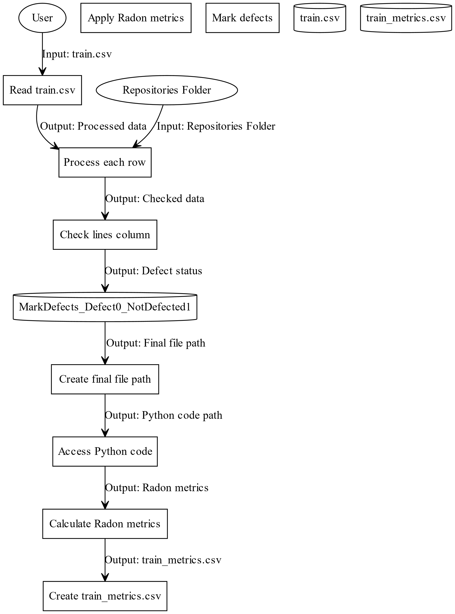
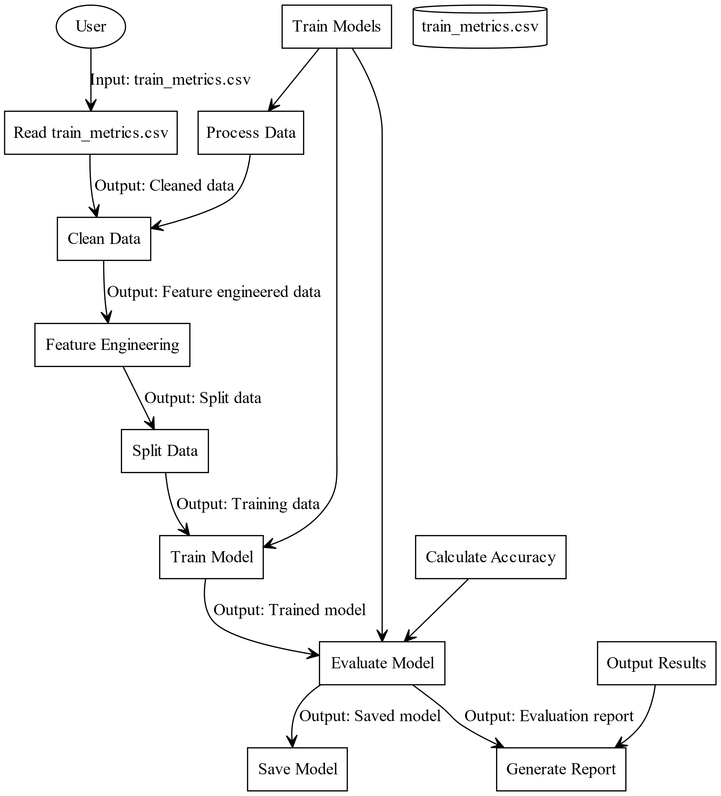
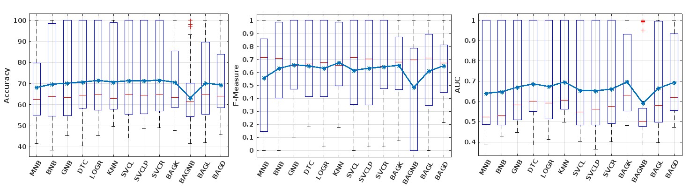

# Software Fault Prediction on the Defectors Dataset #
Predicting which code changes are likely to introduce bugs, before they ship, using machine learning on static code metrics.
## Overview
This project builds a fault-prediction pipeline on the Defectors dataset [(Mahbub, Shuvo, and Rahman, MSR 2023, Dalhousie University)](https://arxiv.org/abs/2303.04738) — roughly 213,000 Python files drawn from 24 open-source repositories across 18 domains. Defectors was chosen specifically because it improves on older defect-prediction datasets: it's Python rather than Java, holds a near 1:1 balance between defective and clean files, and labels each defective file using the SZZ algorithm, which traces a bug back to the commit that actually introduced it, rather than relying on simpler heuristics.
## Methodology
- **Feature extraction**: used [Radon](https://radon.readthedocs.io/) to pull static code metrics directly from raw Python source —lines of code, cyclomatic complexity, Halstead metrics, and code churn — turning unstructured source files into a structured, learnable feature set.
- **Model training**: trained and compared **thirteen classifiers**, spanning Naïve Bayes variants, SVMs with three different kernels, and Bagging ensembles.
- **Feature selection**: layered in PCA, Chi-Square testing, and Genetic Algorithm-based feature selection to evaluate which combinations actually improved generalization, rather than just training accuracy.
- **Evaluation**: tested across 14 separate repositories, not a single train/test split, specifically to check whether a model's performance held up outside the codebase it was trained on.

## Pipeline
**Feature extraction and defect labeling:**

**Model training and evaluation:**

## Key finding

All three metrics run on a 0 to 1 scale. For AUC specifically, 0.5 is the meaningful baseline — that's what random guessing would produce, so any real learning shows up as a score meaningfully above it. Across the thirteen classifiers, accuracy ranged from roughly 0.43 to a perfect 1.0 depending on the repository, and AUC typically fell between 0.4 and 0.7, with some individual cases reaching close to 1.0.

Models that performed best on one repository often failed to generalize to the next. **RBF-kernel SVMs and Bagging ensembles held up most consistently** across repositories, suggesting they were picking up on generalizable patterns rather than overfitting to one codebase's habits. Specifically, **SVCR (the RBF-kernel SVM) reached near-perfect accuracy, close to 100%, on several repositories, and consistently produced the highest F1-scores of any classifier tested.** The Bagging variants (BAGK, BAGL, BAGD) also delivered high accuracy on multiple repositories, though with more variability than SVCR depending on the specific dataset.

*RBF-kernel SVM (SVCR) and the Bagging variants (BAGK, BAGL, BAGD) show tighter, higher-median distributions across all three metrics, compared to the wider spread seen in simpler models like Naïve Bayes.*
## Takeaway
A meaningful share of the actual work in this project wasn't the model training step — it was the feature engineering that came before it, and being honest about when a result didn't generalize.
## Acknowledgments
A B.Tech major project (CSPE-40), supervised by Dr. Lov Kumar, Department of Computer Engineering, National Institute of Technology, Kurukshetra, completed with teammates Shaifali and Mohit.
## Reference
Mahbub, P., Shuvo, O., & Rahman, M. M. (2023). Defectors: A Large, Diverse Python Dataset for Defect Prediction.*20th IEEE/ACM International Conference on Mining Software Repositories (MSR)*, 393–397. [arXiv:2303.04738](https://arxiv.org/abs/2303.04738)

